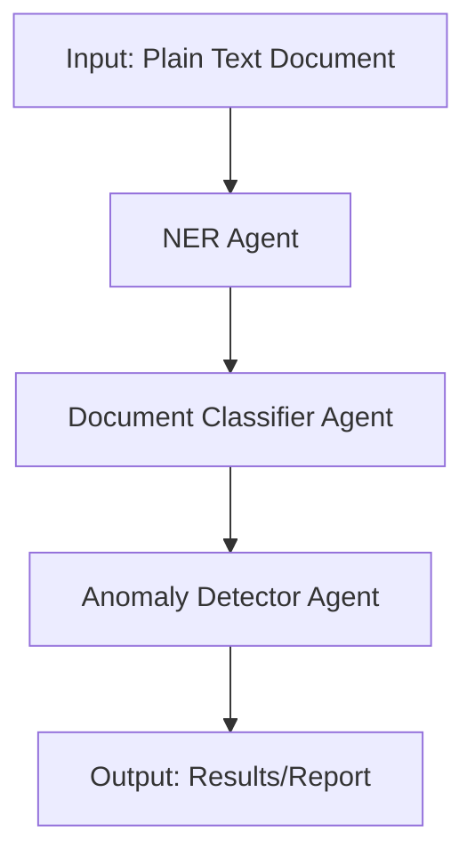

# Multi-Agent LLM Pipeline for Renewable Energy Documents

## Overview
This project demonstrates a multi-agent architecture using LangChain and OpenAI LLMs to process renewable energy documents. The system consists of three agents:

1. **NER Agent**: Extracts named entities (organizations, locations, dates, energy terms).
2. **Document Classifier Agent**: Classifies the document type (e.g., PPA, invoice, contract).
3. **Anomaly Detector Agent**: Detects anomalies or missing critical fields based on document type.

Agents communicate in sequence, passing results to the next stage.

## Architecture


## Setup
1. **Install dependencies:**
   ```bash
   pip install langchain openai
   ```
2. **Get an OpenAI API key:**
   - Sign up at https://platform.openai.com/ and create an API key.

## Usage
Run the main script:
```bash
python main.py
```
- Enter your OpenAI API key when prompted.
- The script will process a sample renewable energy document and print:
  - Extracted entities
  - Document type
  - Anomalies or missing fields

## File Structure
- `ner_agent.py`: NER Agent implementation
- `classifier_agent.py`: Document Classifier Agent implementation
- `anomaly_agent.py`: Anomaly Detector Agent implementation
- `multi_agent_pipeline.py`: Orchestrator for agent communication
- `main.py`: Entry point for running the pipeline

## Example Output
```
Entities:
 [
   {"type": "Organization", "value": "Green Energy Corp"},
   {"type": "Organization", "value": "Solar Solutions Inc."},
   {"type": "Date", "value": "January 1, 2023"},
   {"type": "Location", "value": "California"},
   {"type": "EnergyTerm", "value": "100MW solar power"},
   {"type": "ContractValue", "value": "$50 million"}
 ]

Document Type:
 PPA

Anomalies or Missing Fields:
 None
```

## Notes
- You can modify `main.py` to process your own documents.
- The agents use LLMs and may incur API costs. 